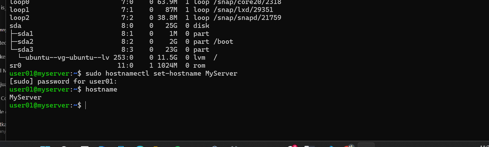
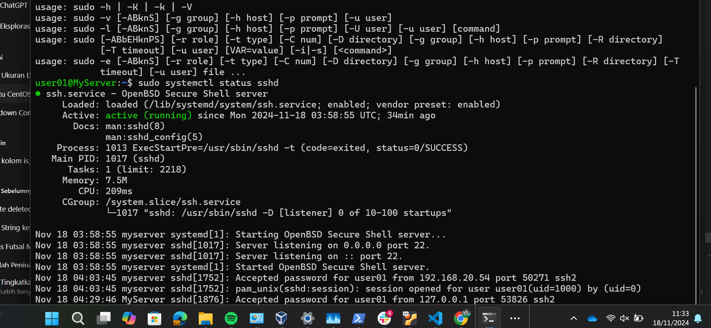
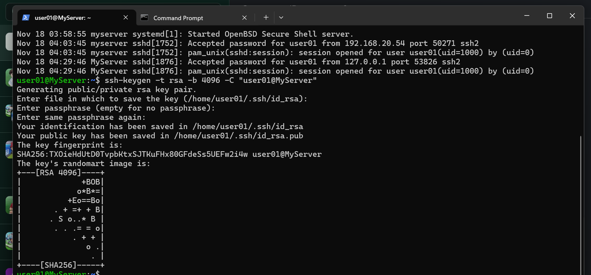
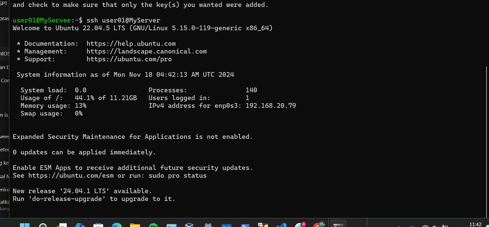
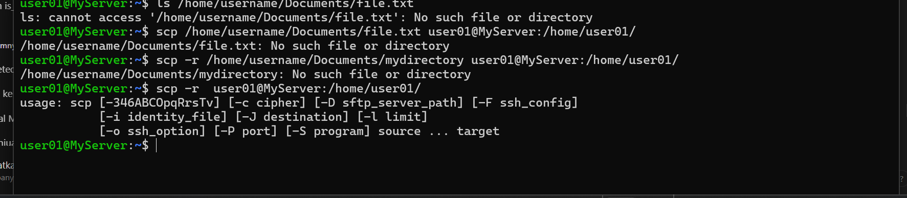

# step tasks devops

pertama ubah hostname dengan nama MyServer

kedua saya make sure open ssh will be started on boot

ketiga saya generate ssh with key pair

keempat coba login MyServer tanpa password

# penjelasan cara kerja ssh

SSH Key-Pair mempunyai 2 yaitu :
- private key = disimpan dikomputer lokal
- public key = ditempatkan diserver

# copy some files/directories using SCP and RSYNC

