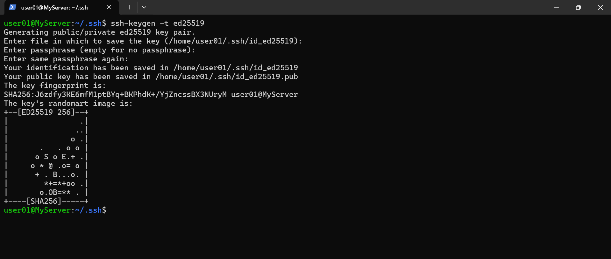
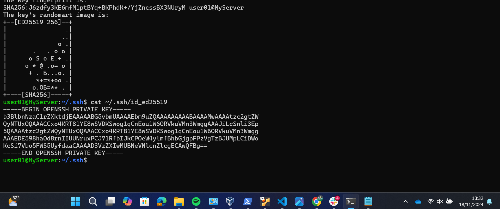
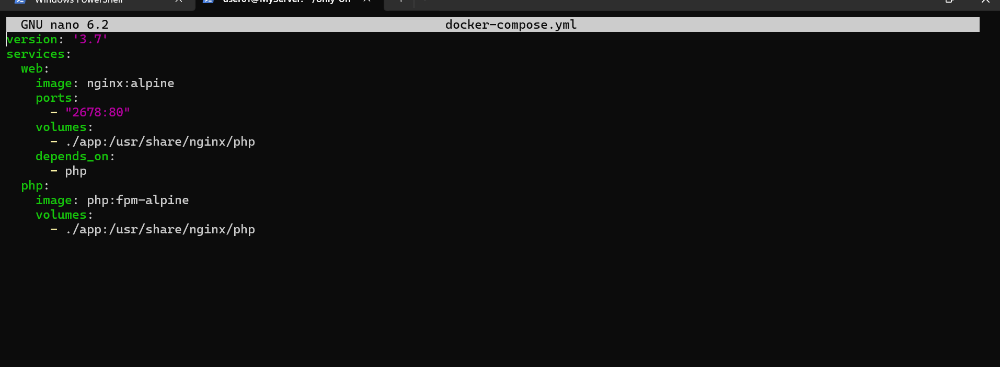
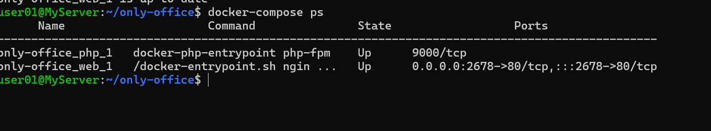

# step tasks devops

pertama ubah hostname dengan nama MyServer

kedua saya make sure open ssh will be started on boot

ketiga saya generate ssh with key pair

keempat coba login MyServer tanpa password

# penjelasan cara kerja ssh

SSH Key-Pair mempunyai 2 yaitu :
- private key = disimpan dikomputer lokal
- public key = ditempatkan diserver

# copy some files/directories using SCP and RSYNC

# membuat ssh local (private_key)

# show ssh local (private_key)

 - user01@MyServer:~/only-office$ logout
Connection to 192.168.20.79 closed.
PS C:\Users\LAWENCON>

command diata adalah untuk logout dari server

- PS C:\Users\LAWENCON> ssh user01@192.168.20.79

command ini digunakan untuk login server, yaitu servernya 192.168.20.79

- user01@MyServer:~$ pwd

untuk mengetahui posisi kita lagi dimana

- user01@MyServer:~$ ls

untuk menampilkan isi file dan direktori

- user01@MyServer:~$ cd only-office

command ini untuk berpindah ke direktori lain

- user01@MyServer:~/only-office$ mkdir app

untuk membuat direktori baru di direktori only-office

- user01@MyServer:~/only-office$ cat docker-compose.yml

untuk menampilkan isi content docker-compose.yml

- user01@MyServer:~/only-office$ nano docker-compose.yml

untuk mengedit isi content dari docker-compose.yml

- user01@MyServer:~/only-office$ rm docker-compose.yml

untuk menghapus direktori/file

jadi ports:
      - "2678:80"

- port 80 = adalah port internal yang digunakan nginx di dalam container
- port 2678 = adalah port host nya yang kita buat di docker.compose.yml

**user01@MyServer:~/only-office$ docker-compose up -d** =
command ini untuk running docker compose

command untuk melihat container apa aja yang jalan